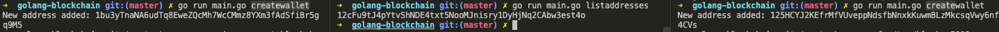
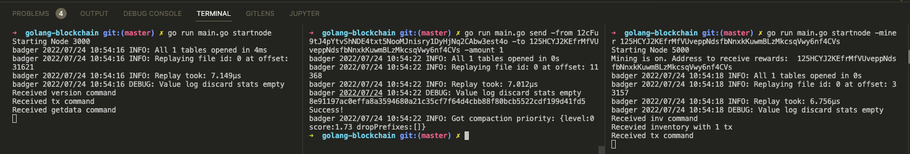
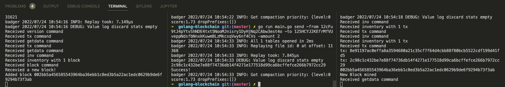

# Bitcoin in Go

## Slides

[What's Under the Hood of Bitcoin?](https://hackmd.io/nzxSK_5bT7O7UM3RAWUEbg)

## Usage

```
➜ go run main.go
Usage:
 getbalance -address ADDRESS - get the balance for an address
 createblockchain -address ADDRESS creates a blockchain and sends genesis reward to address
 printchain - Prints the blocks in the chain
 send -from FROM -to TO -amount AMOUNT -mine - Send amount of coins. Then -mine flag is set, mine off of this node
 createwallet - Creates a new Wallet
 reindexutxo - Rebuilds the UTXO set
 listaddresses - Lists the addresses in our wallet file
 startnode -miner ADDRESS - Start a node with ID specified in NODE_ID env. var. -miner enables mining
```

## Demo

1. First, create 3 different wallet addresses
   
2. Spin up 2 Bitcoin nodes, and then send bitcoin from the middle address to the right-hand side. As you can see, there's no new block been mined yet.
   
3. Create another transaction, this time it exceeded the block size so miner is going to pack up these trx and mine a new block:
   
4. `go run main.go printchain` print the block chain!

   ```
   ➜  golang-blockchain git:(master) ✗ go run main.go printchain
   Prev. hash: 00281e8fa2346d2158ccfb548d25893209663a03f53e407ff62addcc6a1e87c1
   Hash: 003a2da487ee111048d749274a06dcd88e9598a57023fe14962ae1c092e900f4
   PoW: true
   --- Transaction f71f3ce30f999c66c9002a6ba9eb4bc015f33e667d55917ccbcd5b2e44795623:
       Input 0:
       TXID:
       Out:       -1
       Signature:
       PubKey:    35383233666563303231356239633665636631336236623739323765343962346339633830306265
       Output 0:
       Value:  100
       Script: 4f3d2855e40489828962bb0c3adf31f4e90cc32538eef98a59fd778cd828c269
   --- Transaction 5c9464b9ee20f139a17e03c5b5bd2cb949b2b7ce4f5acf1aa2efb5470682cf26:
       Input 0:
       TXID:     169fb0184dae5480cca94aaa3ee0ccbc602f0348afa456e0be96c680acbea98b
       Out:       1
       Signature: b2a1bfe477013aab3175614fb88adf82b219c9539b6d15161e4ff06c48730d5cf37b8c23aac63994abd08f83ff5bc29f5d5048829d7ae63823347e17b5cc2846
       PubKey:    4db79bdad06d8779e025157b69f441567dc2b1cd007c0c494f426a8e3e56b8cedd89c14a0f4bf359b0120b8cf6282dd81d854c399a97eb1a029fc8d4ca922a58
       Output 0:
       Value:  10
       Script: d3c04c0c91e87753f9a4c304749db36fde82b71dcfb087cbf1cdb635a69a9615
       Output 1:
       Value:  50
       Script: 4f3d2855e40489828962bb0c3adf31f4e90cc32538eef98a59fd778cd828c269

   Prev. hash: 002c28008b762210bbedcb45a391b154d3056a659b37fb9ccc02f4c461eb34b8
   Hash: 00281e8fa2346d2158ccfb548d25893209663a03f53e407ff62addcc6a1e87c1
   PoW: true
   --- Transaction 59b9c198f07cec5d74fd282bd4a0996f1cea685df574eee7af9f7dd9fab3cb65:
       Input 0:
       TXID:
       Out:       -1
       Signature:
       PubKey:    63343163653137663430316262316662626166656639623164356638626461363334316239313764
       Output 0:
       Value:  100
       Script: 4f3d2855e40489828962bb0c3adf31f4e90cc32538eef98a59fd778cd828c269
   --- Transaction 169fb0184dae5480cca94aaa3ee0ccbc602f0348afa456e0be96c680acbea98b:
       Input 0:
       TXID:     119879a4657dd9d2276c9bd8366e55d36b7a6e587a35cd224d8058b13187d8e5
       Out:       1
       Signature: d99feac4129aaf22731cd39aa2cc3262c0f2c18ffcf409792125dec7a0a0792195f2b2035b199dd6c3d7822d144881dd53cc6d0c721dfdc3168a5e6b39a515fa
       PubKey:    4db79bdad06d8779e025157b69f441567dc2b1cd007c0c494f426a8e3e56b8cedd89c14a0f4bf359b0120b8cf6282dd81d854c399a97eb1a029fc8d4ca922a58
       Output 0:
       Value:  10
       Script: d3c04c0c91e87753f9a4c304749db36fde82b71dcfb087cbf1cdb635a69a9615
       Output 1:
       Value:  60
       Script: 4f3d2855e40489828962bb0c3adf31f4e90cc32538eef98a59fd778cd828c269
   ```

## Reference

<https://www.youtube.com/watch?v=mYlHT9bB6OE&list=PLJbE2Yu2zumC5QE39TQHBLYJDB2gfFE5Q&index=1>
